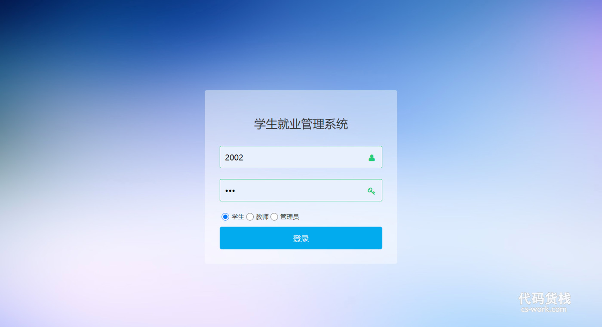
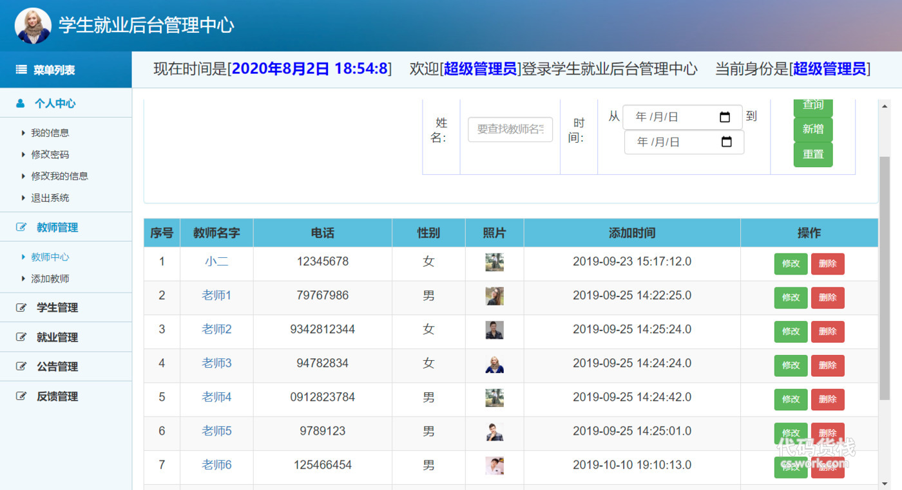
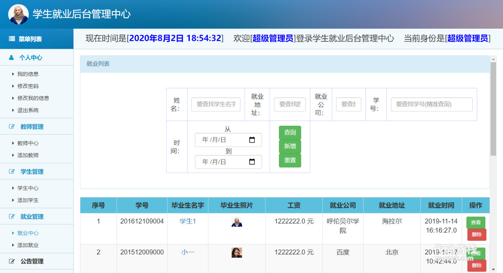
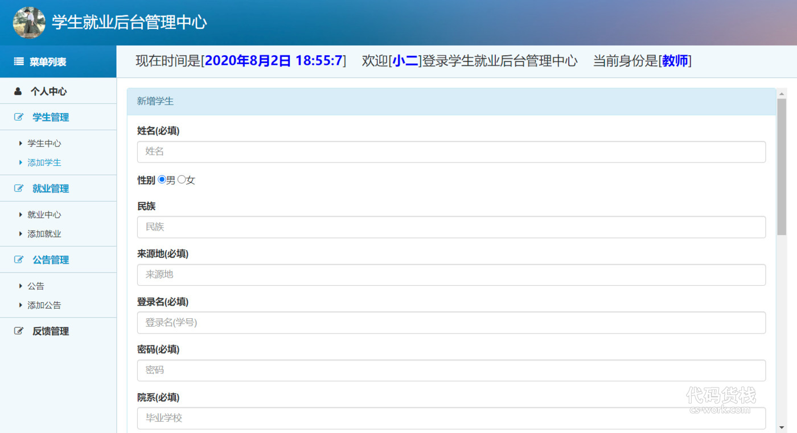
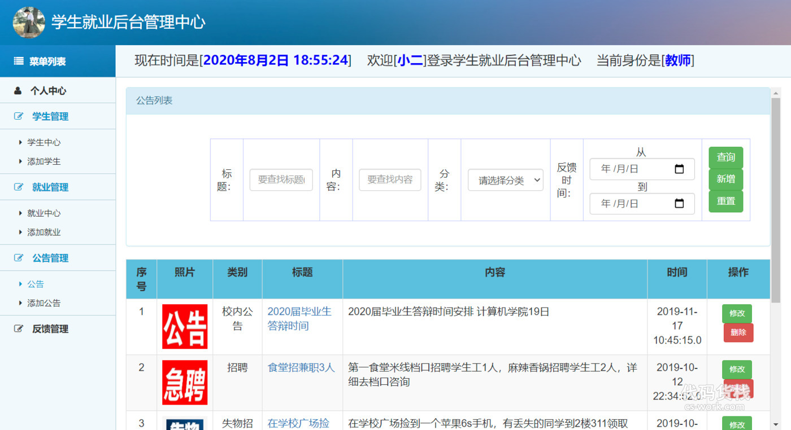
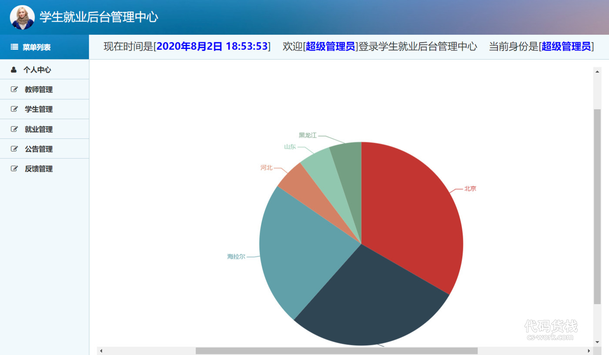

## 基于SSM框架实现的高校学生就业管理系统(程序+课程报告)

###  获取sql数据库文件: 从戎源码网 (https://armycodes.com/) QQ: 386869957 QQ群: 377586148
###  所有系统地址: (https://github.com/YuLin-Coder/AllProjectCatalog) 
###  所有项目以及源代码本人均调试运行无问题 可支持远程安装部署调试、定制修改、代码讲解

## 项目介绍
基于SSM框架实现的高校学生就业管理系统，包含两种角色：学生、管理员、教师三个角色,系统分为前台和后台两大模块，主要功能如下。

【学生】
个人中心：我的信息、修改密码、修改个人信息、退出系统
就业中心、公告、反馈

【教师】：
1. 个人中心：教师可以查看和修改个人信息，包括姓名、联系方式等。
2. 学生管理：教师可以管理学生的信息，包括查看学生信息、编辑学生信息和删除学生信息。
3. 就业管理：教师可以管理学生的就业情况，包括查看学生的就业信息、添加学生的就业信息和编辑学生的就业信息。
4. 公告管理：教师可以发布、编辑和删除系统公告，通知学生和其他教师。
5. 反馈管理：教师可以查看学生的反馈信息，对反馈进行处理和回复。

【超级管理员】：
1. 菜单列表：超级管理员可以查看系统的菜单列表，包括各个模块的功能。
2. 个人中心：超级管理员可以查看和修改个人信息，包括姓名、联系方式等。
3. 教师管理：超级管理员可以管理教师的信息，包括添加、编辑和删除教师信息。
4. 学生管理：超级管理员可以管理学生的信息，包括添加、编辑和删除学生信息。
5. 就业管理：超级管理员可以管理学生的就业情况，包括查看就业信息、添加就业信息和编辑就业信息。
6. 公告管理：超级管理员可以发布、编辑和删除系统公告，通知教师和学生。
7. 反馈管理：超级管理员可以查看用户的反馈信息，对反馈进行处理和回复。

## 项目技术
- 编程语言：Java
- 数据库：MySQL
- 前端技术：JSP、HTML、Jquery、Bootstrap、Layui、ECharts
- 后端技术：Spring、SpringMVC、MyBatis

## 运行环境
- JDK版本：JDK1.8及以上
- 开发工具：IDEA、Ecplise、Myecplise都可以
- 数据库: MySQL5.7及以上
- Maven：maven3.0及以上

## 运行截图

